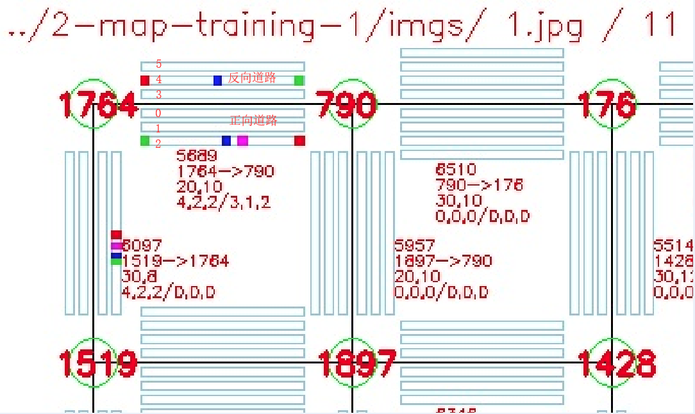

## 2019 华为软件精英挑战赛 地图可视化

## 一、基本信息

### 1. 源信息

赛事官网：https://codecraft.huawei.com/

本可视化内容基于 https://github.com/AkatsukiCC/huawei2019-with-visualization 魔改而来。

主要魔改：降低了绘制时间，修改了显示内容，自己的坐标计算方式。

### 2. 目录说明

1. \*-map-\* 是官方的地图

2. map-strange-\* 是个人测试坐标计算方法用的跨节点的道路的地图，虽然官方没有出这种图

3. src 下面是代码

部分地图目录下，有imgs文件夹，里面有empty.jpg，是当前这幅地图的空地图（即路上没有车的图）。注意，有的图不是用新版本的代码绘制的

### 3. src 下代码文件说明

#### 1. CrossCoordinate.py

通过road.txt 和 cross.txt 建立地图坐标。用于指导绘制位置。（这里不是像素坐标，仅仅只是各路口在坐标系中的位置）

此文件额外实现了跨节点绘制道路。（默认道路是不会跨路口的，即路口(0,0)和(0,2)，若有道路直连，则属于跨节点情况，虽然最后没有考到这种情况）

#### 2. CoordinateFileOper.py

文本形式的坐标标记，没啥用

#### 3.  MapVisualization.py

核心

实现地图绘制。

#### 4. TestCrossCoordinate.py

测试文件

若改动了CrossCoordinate.py文件的计算方式，使用此文件确保几张奇怪地图的坐标计算结果正确。

#### 5. TimeTools.py

工具：计算运行时间，上述代码中应该注释掉了这个文件

## 二、MapVisualization.py 文件的使用

绘图只需要关注文件中的 Visualization 类。

### Visualization 类

### 绘制思路：

1. 通过 road.txt 和 cross.txt 计算每个路口坐标。
   
   生成的坐标系是以左上角为原点(0,0)，横向向右是x轴正方向，纵向向下是y轴正方向。
   
   例如，路口1坐标是(0,0)，路口2坐标是(0,1)。

2. 通过路口坐标，映射到像素坐标。
   
   例如规定每条道路长200像素，则路口1像素坐标是(0,0)，路口2坐标是(0,200)。（当然，如果从0坐标开始绘制，在图片上有的部分就绘制在图片外了，所以，四周一般要预留一部分像素）。

3. 计算每条道路的像素坐标，包括道路上每个车位的像素坐标。
   
   这个利用路口与道路的相对关系可求。
   
   这步完成后，可以绘制地图的空图。

4. 根据道路上车况，在对应车位上绘制颜色块表示相应车辆。

### 初始化接口：

visual =  Visualization(car_path,road_path,cross_path,preAns_path,savePath,**kwargs)

  car_path : str，car.txt 的路径. 如 "C:/car.txt"，相对或绝对路径

  road_path : str，road.txt 的路径

  cross_path : str，cross.txt 的路径

  preAns_path : str，presetAnswer.txt 的路径

  savePath : str，存放生成的图片的目录. 如 "C:/imgs/"

   **kwargs : dict，其他控制参数，可不传递，使用默认即可。

        randomColor = False 参数控制普通车子是否使用随机颜色标色，默认为False，即不随机，普通车统一用绿色标色。
                普通车用绿色
                优先车用紫色
                预置车用蓝色
                优先预置车用红色
    
        showRoadInfo = True 参数，控制是否显示红色的道路情况信息，默认True。
    
        computeCoordinate = 1 参数。默认为1，即原作者坐标计算方式。若为2，增强计算方式，可以计算跨结点道路（如map-stange-*中的图）的图（要用到 CrossCoordinate.py 文件）。

#### 以下是绘制接口

1. visual.drawMap(filename)
   
   绘制一张图片，图片名为filename，如"empty"，路径是savePath。
   
   直接调用此接口，则绘制一张空地图（即只有路口和道路的，没有任何运行车辆）。
   
   注：绘制空地图时，presetAnswer.txt和car.txt文件内容可以为空（如，当你自己创建了自定义地图，想看一下地图长什么样子时，只需要提供cross.txt和road.txt两个文件，而presetAnswer.txt和car.txt文件内容可以为空）。

2. visual.drawImgsFromJsonFile(jsonfileName)
   
   visual.drawImgsFromJsonFile(jsonfileName)
   
   jsonFileName : str，json文件的路径，如"C:/result.json"
   
   读取json文件进行绘制。
   
   json文件内容即是下面jsonDict对象以json格式进行储存的内容。
   
   所以，该接口是读取json文件后，然后再调用解析jsonDict的接口进行绘制而已。
   
   若对json文件内容有困惑，在 3-map-training-2 地图下，附带了一个json文件。里面有82个时刻的地图流量数据。

3. visual.drawImgsFromJsonDict(jsonDict)
   
   传递一个 json 字典进行绘制。
   
   （这种方式，也就Python的调度器能用，所以不推荐，使用上面的解析json文件的方式更科学，更通用）
   
   该 jsonDict 结构：

```python
jsonDict = {
    # 这里id等信息取自 2-map-training-1 地图。
    "1":{  # "1" 是当前调度时刻，如 "1","2","3"... 等。
        "5689":{  # "5689" 是id=5689的道路
            "2":{ # "2" 是 "5689" 这条路的某条车道号
                  # 这里车道号规则，以 双向3车道为例
                  # 正向道路，靠近中间的就是0，外侧是2
                  # 反向道路，靠近中间的是3，外侧是5
                  # 其排列应该是 5 4 3 || 0 1 2 (向上的方向是正向方向)
                "20556":"0", # 普通车
                  # id="20556"的车，离车道起始点的位置（范围0~length-1）
                  # 正向车道起始点就是1764，反向车道起始点是790
                "37819":"10", # 预置
                "45938":"12", # 优先
                "55541":"19", # 优先预置
            },
            "4":{
                # 这里车id和上面一样仅是因为没有去car.txt中找其他id而已
                # 实际中，肯定不可能同id车出现在两个道路。
                "20556":"0", # 普通车
                "37819":"10", # 预置
                # "45938":"12", # 优先
                "55541":"19", # 优先预置
            },
        },
        "6097":{
            "1":{
                "20556":"9",    
                "37819":"10", # 预置
                "45938":"12", # 优先
                "55541":"14", # 优先预置
            },
        },  
    },
}
```

绘制之后的效果如（用2-map-training-1中相关文件初始化后，调用上述接口）：



上图中元素说明

  a. 图片左上角，显示的是 该图片生成的路径，和该地图中总车数（如上图有11辆车）

  b. 每条路正向车道在道路正方向的右侧

  c. 每条道路旁的四行信息（可用初始化时的showRoadInfo参数控制是否显示）

    5689 : 该道路 id
    
    1764 -> 790 : 该道路正方向
    
    20,10 : 该道路长度和限速
    
    4,2,2/3,1,2 : 该道路正向/反向方向上，总车数，优先车数，预置车数。（空地图没有这行信息）

## example

下面exmaple，是以MapVisualization文件所在目录为相对路径的。

### 1. 绘制空地图

```python
from MapVisualization import Visualization
config = '../3-map-training-2/'
car_path    = config + 'car.txt'
road_path   = config + 'road.txt'
cross_path  = config + 'cross.txt'
preAns_path = config + 'presetAnswer.txt' 
savePath    = config + 'imgs'

visual = Visualization(car_path,road_path,cross_path,preAns_path,savePath)
visual.drawMap('empty')
```

### 2. 绘制 json 文件中内容

```python
from MapVisualization import Visualization

config = '../3-map-training-2/'
car_path    = config + 'car.txt'
road_path   = config + 'road.txt'
cross_path  = config + 'cross.txt'
preAns_path = config + 'presetAnswer.txt' 
savePath    = config + 'imgs'

visual = Visualization(car_path,road_path,cross_path,preAns_path,savePath)

visual.drawImgsFromJsonFile(config + 'result_java.json')    
```

### 3. 调用jsonDict接口绘制

```python
from MapVisualization import Visualization
config = '../2-map-training-1/'
car_path    = config + 'car.txt'
road_path   = config + 'road.txt'
cross_path  = config + 'cross.txt'
preAns_path = config + 'presetAnswer.txt' 
savePath    = config + 'imgs'

visual = Visualization(car_path,road_path,cross_path,preAns_path,savePath)
jsonDict = {
    "1":{  
        "5689":{ 
            "2":{ 
                "20556":"0", 
                "37819":"10", # 预置
                "45938":"12", # 优先
                "55541":"19", # 优先预置
            },
        },
    },
}
visual.drawImgsFromJsonDict(jsonDict)
```

### 4. 绘制一张strange空地图

然而官方没有考这种跨结点的道路的地图。也不知道坐标计算方式有没有bug。

```python
from MapVisualization import Visualization
config = '../map-strange-1/'
car_path    = config + 'car.txt'
road_path   = config + 'road.txt'
cross_path  = config + 'cross.txt'
preAns_path = config + 'presetAnswer.txt' 
savePath    = config + 'imgs'

visual = Visualization(car_path,road_path,cross_path,preAns_path,savePath,computeCoordinate=2)
visual.drawMap("strange-1")
```

自定义的跨节点道路效果图：


